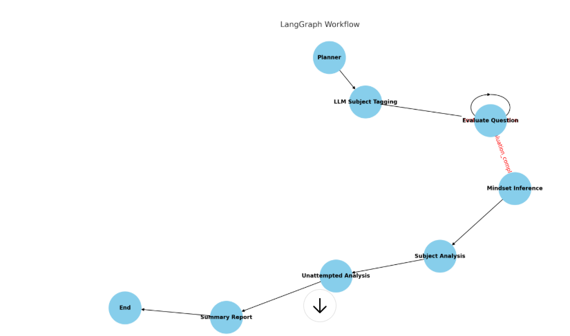

# UPSC Prelims Exam Performance Analyzer

This project is a Flask-based backend application that analyzes UPSC Prelims exam responses using advanced AI-driven analysis with LangChain, LangGraph, and OpenAI's GPT models. The system evaluates student answers, infers cognitive mindset insights on incorrect responses, performs subject-wise performance breakdown, analyzes unattempted questions, and generates a comprehensive summary report with actionable study recommendations.

---


## Features
- **subject_tagging:** Generate subject name for each question
- **Automated Question Evaluation:** Classifies each answer as Correct, Wrong, or Unattempted.
- **Mindset Analysis:** Deep cognitive insights on why a student chose incorrect options, identifying misconceptions and knowledge gaps.
- **Subject Performance Breakdown:** Calculates accuracy and highlights strong and weak subjects.
- **Unattempted Question Analysis:** Explains potential reasons for skipping questions.
- **Comprehensive Summary Report:** Provides detailed feedback and an actionable plan for future exam preparation.

---
## 🏗️ Architecture
### Frontend (React.js + TailwindCSS)
- Upload exam JSON and send to backend
- Show streamed or generated report
- Uses Axios for API calls
- Styled with Tailwind CSS
### Backend (Flask + LangGraph + OpenAI)
- Python Flask app exposes /api/analyze_exam
- LangGraph orchestrates analysis steps:
- Planning
- Subject Inference (LLM or keyword-based)
- Evaluation
- Mindset Inference
- Subject Performance Analysis
- Unattempted Reasoning
- Summary Report
  
### Prerequisites
- Python 3.8+
- Flask (Web API)
- LangChain, LangGraph (AI workflow orchestration)
- OpenAI GPT-3.5-turbo (Language model)
- Pydantic (Data validation)
- dotenv (Environment variable management)
- Flask-CORS (Cross-origin resource sharing)

---
## Setup Instructions
### 1. Clone the Repository

```bash
git clone https://github.com/divyasri6/upsc-prelims-analyzer.git
cd upsc-prelims-analyzer
```
### 2. Create and Activate a Virtual Environment

```bash
python -m venv venv
source venv/bin/activate   # On Windows use: venv\Scripts\activate
```
### 3. Install Dependencies
```bash
pip install -r requirements.txt
```
### 4. Configure Environment Variables

Create a .env file in the root directory with your OpenAI API key:

```ini
OPENAI_API_KEY=your_openai_api_key_here
TAVILY_API_KEY=your_tavily_api_key_here
```
### 5. Run the Flask Server
```bash
python app.py
The API will be available at http://127.0.0.1:5000/api/analyze_exam
```
## Graph


## API Usage
### Endpoint
```bash
POST /api/analyze_exam
Content-Type: application/json
```
## Request Body
```json
{
  "task": "Analyze UPSC Prelims performance.",
  "all_questions": [
    {
      "id": "1",
      "text": "Which river is known as the 'Ganga of the South'?",
      "options": {
        "A": "Godavari",
        "B": "Krishna",
        "C": "Cauvery",
        "D": "Narmada"
      },
      "correct_option": "A",
      "chosen_option": "A",
      "subject": "Geography"
    },
    ...
  ]
}
```
### Response
```json
{
  "report": "<string> Comprehensive textual analysis report...",
  "final_state": { ... }  // Detailed JSON object of all intermediate analysis states
}
```
## Frontend Setup
```bash
cd ../client
npm install
npm run dev
```
Visit http://localhost:3000
# online Deployment
- https://upsc-frontend-9tkb.onrender.com
- https://upsc-backend-0pey.onrender.com/api/analyze_exam'
# 📝 License
MIT License
